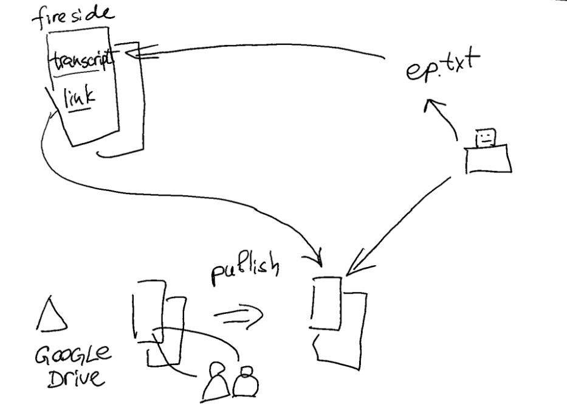

# Fireside transcript from Google Docs

[Watch on Youtube](https://youtu.be/MO5z1oYoVZw)

## Background
I have a podcast on the Fireside platform, and for each episode on Fireside, I want to add transcripts. The problem I see is that if I have a link to a transcript stored in Google Drive, those transcripts are not indexed by search engines. This means that if someone searches for certain words or themes discussed in the podcast, they will not be available for users to search. As a result, the discoverability of my podcast will suffer. However, I would like to keep my Google documents on Google Drive because I have multiple users helping me with these transcriptions, and I want to utilize the Google Docs functionality to allow those users to work on the transcripts. Then, I can publish those transcripts on the web and link to the published versions instead. But how can I address the issue of discoverability?

It turns out that Fireside provides an option to publish transcripts for each episode, and those transcripts are indexed by search engines. So those transcripts could be indexed, but they are difficult to work with because they need to be uploaded as files to my Fireside episodes. How can I maintain the convenience of multiple users helping me with the transcriptions while ensuring the discoverability of published episode transcripts alongside the link to the published Google document?

## Automation overview
I can create an automation that will take the published version of the transcript. Using a robot, which can run locally on my machine or in the cloud, it can retrieve the link and extract the text from the published transcript. Then, it can generate a .txt file for the episode and upload this file as a transcript on Fireside. Let me demonstrate how this works in practice.

Let's assume I have already published some transcripts, but I want to update, for example, Episode 0. The transcript for Episode 0 currently looks like this. Now, I will add some text, let's say "Updated 02," and save it. Let me show you how this transcript appears on the site. Here is my podcast, and I have updated the file for Episode 0. Let's click on the link to the published Google document. Google documents take some time to update the published version, so maybe we won't see the updated version yet. However, I have run some tests, and the transcript here does not contain the update we just published. For the sake of this demonstration, let me update another episode transcript. Let's choose Episode 01. I will copy and paste some previous words here. It doesn't really matter for this demo. So this will be Episode 02, and this is my updated version. Now let's go to Episode 1 and click on the link here. Let's see if it updates. Yes, it is automatically updated, but the transcript indexed by search engines has not been updated yet. It still shows the old version.

To solve this issue, we can employ a robot that will assist us. As with most tasks involving robots, it will involve some Python programming. I have a demo available, which is a proof of concept. It is not final, but it demonstrates how this will work. In this window, we can select the episodes for which we would like to update the transcripts. It can be a group of episodes, so we can update all episodes with transcripts, or we can choose a subset of episodes. As a reminder, I started from Episode 0 and updated up until Episode 1. When I press the "Update Transcript" button, this robot will visit my podcast site, find the link containing the word "transcript," retrieve the Google Docs link from there, download the text from that link, create a text file for the episode, and update the transcript file on Fireside. This updated transcript file will then be indexed by Google and be available for search. 

## Demo
Let me show you how this will look visually. So I press "Update Transcript." It says, "Okay, it's grabbing Episode 0." Now it needs to upload the transcript, which is only possible through the user interface on the website. That's why the robot opens the site, enters the credentials, and clicks on the required links. Next, it grabs the second episode. It will log in to the site again, navigate to the second episode (Episode 1), update the file with the transcript, click on the update button, and then close the browser. All these steps are performed without any manual intervention. The only input I provided manually was selecting the range of episodes for which I need to update the transcripts.

Now let's see. Remember that Episode 1 was very short in the transcript. If I click here and refresh the page, we will see the full text that I added in the Google document. Let's check the same for Episode 0. The cached version of the transcript is the updated one. 

## Conclusion
This approach allows us to maintain the simplicity and convenience of working with Google Drive documents while publishing them as discoverable transcripts. I hope this explanation helps. 

